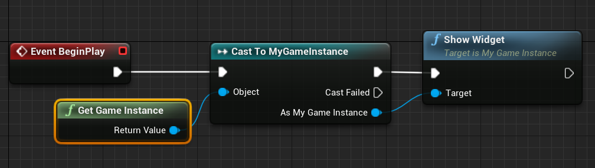
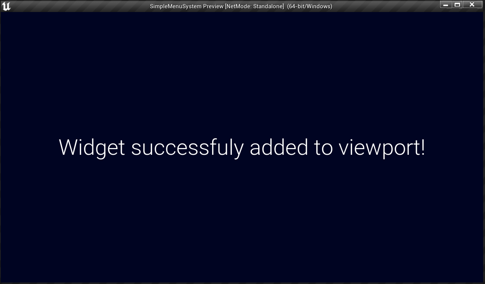

# UI Programming: Adding widgets to viewport with C++
**Engine Used - ** Unreal Engine
## Workflow
- Created a custom GameInstance using C++
- Added functionality to check for the presence of the menu widget class
- Created a custom function **ShowWidget()** to create the widget & change game mode to UI only 
## Result
The custom function can be used in blueprints or other C++ classes to display the menu.

